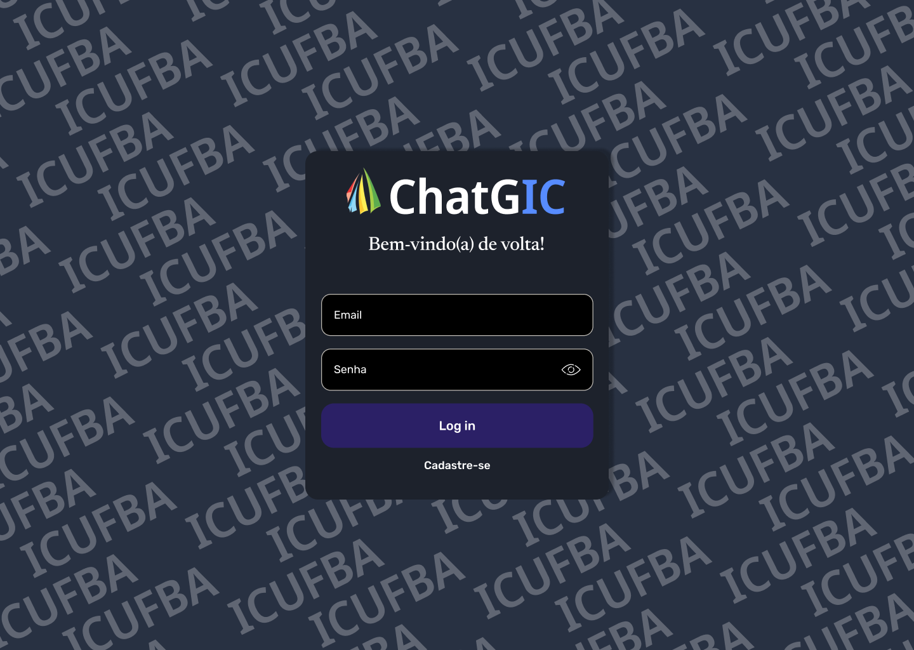
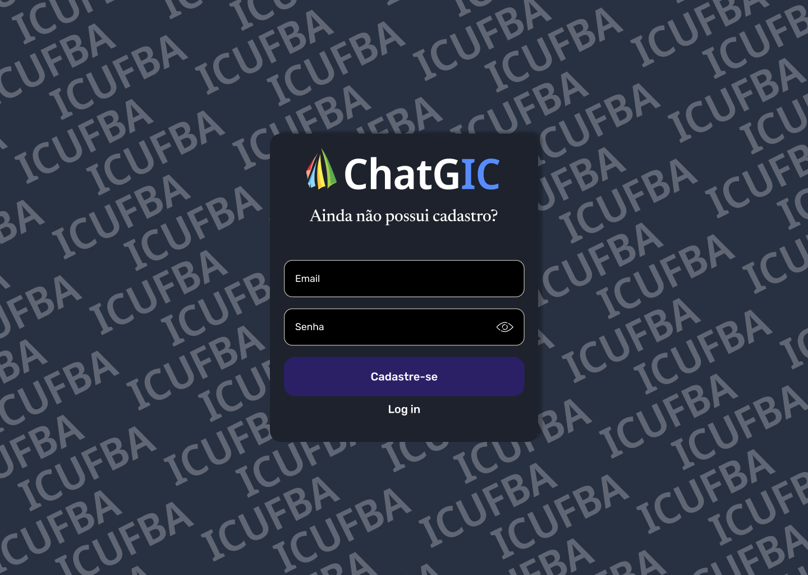
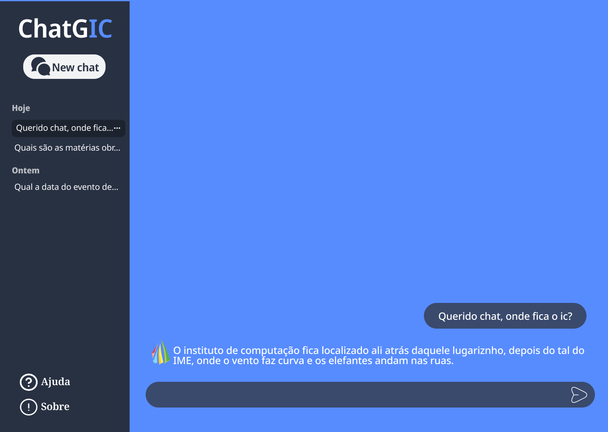
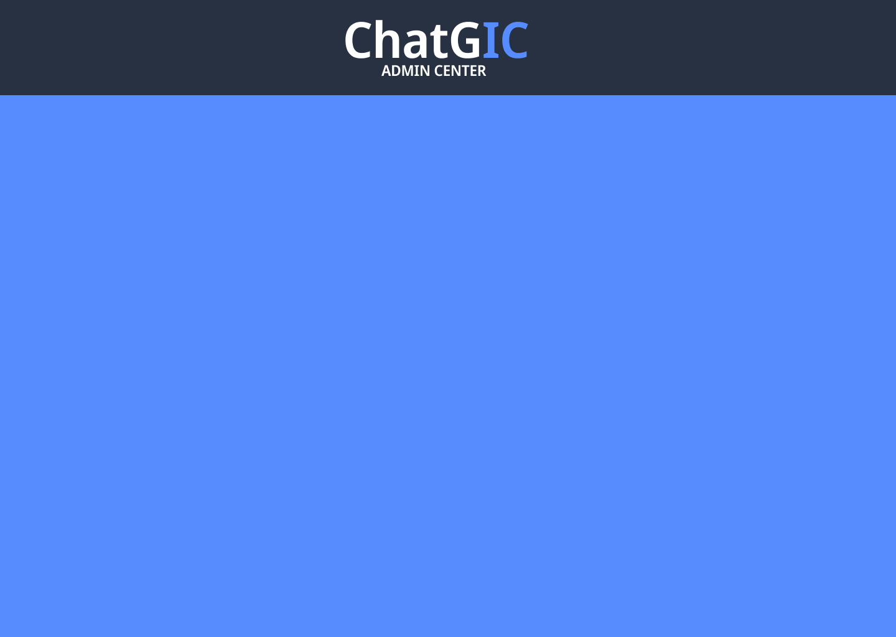

# ChatGIC - Assistente Virtual do IC-UFBA

Projeto Final da disciplina de Engenharia de Software I (MATA62). Projeto que consiste na criação de IA especialista no Instituto de Computação da UFBA. Além de agentes especialistas de cada disciplina.

## Estrutura do Projeto

```
projeto-final-eng-software/             # Pasta do projeto
├── assets/                             # Pasta de assets do projeto
│   ├── background/                     # Imagens de fundo
│   │   └── background-sign.png         # Imagem de fundo das telas de autenticação
│   ├── figma-screens/                  # Telas desenvolvidas no Figma
│   │   └── home/                       # Telas do Figma - Home Screen
|   |   |   └── home.png                # Tela - Home Screen
|   |   |   └── admin.png               # Tela - Admin Screen
│   │   └── sign/                       # Telas do Figma - Autenticação
|   |       └── in.png                  # Tela - Login Screen
|   |       └── up.png                  # Tela - Cadastro Screen
│   └── icons/                          # Ícones do projeto
│       ├── eye.svg                     # Ícone para mostrar/ocultar senha
│       └── logo-site.png               # Logo ICUFBA
├── screens/                            # Pasta de telas do projeto
│   ├── home/                           # Tela principal
│   |    └── home.html                  # Página inicial após autenticação
│   |    └── styles.html                # Estilos da página inicial após autenticação
│   └── sign/                           # Telas de autenticação
│       ├── in.html                     # Login
│       └── script.js                   # Lógica de autenticação e validação
│       ├── styles.css                  # Estilos das duas telas
│       ├── up.html                     # Cadastro
├── Readme.md                           # Você está aqui!
```

## Descrição dos Arquivos

### Telas de Autenticação (Sign)

- **in.html**: Página de login com campos para email e senha com validações.
  - Elementos semânticos HTML5;
  - Meta tags otimizadas para SEO;
  - Alertas sobre regras de negócio da autenticação.

- **up.html**: Página de cadastro com validações.
  - Elementos semânticos HTML5;
  - Meta tags otimizadas para SEO;
  - Alertas sobre regras de negócio da autenticação.

- **styles.css**: Estilos das páginas.
  - Design responsivo;
  - Animações de transição;
  - Sistema de alertas estilizado;
  - Temas e cores consistentes.

- **script.js**: Lógica de autenticação.
  - Validação de email;
  - Validação complexa de senha;
  - Sistema de alertas dinâmicos;
  - Redirecionamento após autenticação.

### Tela Principal (Home)

- **home.html**: Interface principal do sistema.
  - Será a interface do chat com a IA;
  - Em desenvolvimento...

## Features Implementadas

- Sistema de autenticação (front-end);
- Validações de formulário;
- Alertas personalizados com animações;
- Design responsivo;
- SEO otimizado;
- Acessibilidade (ARIA labels).

## Telas desenvolvidas no Figma

1. Login Screen

2. Register Screen

3. Home Screen

4. Admin Screen
